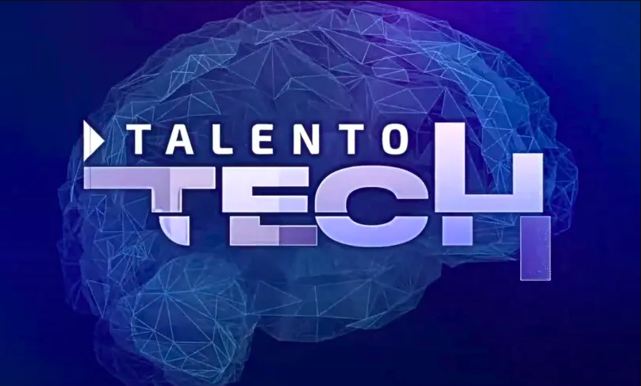

    <h1># Predicción de los Precios de Airbnb Usando Modelos de Machine Learning</h1>

# Predicción de los Precios de Airbnb Usando Modelos de Machine Learning

Cristian Iván Parra Mesa
2 de junio de 2024

---

## Elección del Tema y Definición del Objetivo

### Descripción del tema elegido

El tema elegido para este proyecto es la predicción de los precios de alquiler de propiedades en la plataforma Airbnb. Con la creciente popularidad de Airbnb, los anfitriones y los potenciales inquilinos se enfrentan al desafío de determinar precios justos y competitivos. El análisis y predicción de estos precios puede ayudar a los anfitriones a maximizar sus ingresos y a los inquilinos a encontrar ofertas adecuadas.

### Objetivo del proyecto

El objetivo del proyecto es desarrollar un modelo de machine learning que pueda predecir con precisión los precios de alquiler de propiedades en Airbnb. Utilizando un conjunto de datos extraído de Kaggle, se aplicarán diversas técnicas de limpieza, transformación y modelado de datos para lograr predicciones precisas y fiables.

---

## Recopilación de Datos

### Descripción de las fuentes de datos utilizadas

Los datos utilizados en este proyecto se han extraído de Kaggle, una plataforma conocida por albergar diversos conjuntos de datos para análisis y competencia en machine learning. El dataset específico utilizado es el de precios de alquiler de propiedades en Airbnb. Este dataset puede ser consultado en el siguiente enlace: [Dataset](https://www.kaggle.com/datasets/paramvir705/airbnb-data)

### Procedimiento de recopilación de datos

El procedimiento de recopilación de datos incluye los siguientes pasos:

1. Descargar el dataset de Kaggle desde la página correspondiente a través de la API.
2. Cargar los datos en un entorno de trabajo de Python (Jupyter Notebooks) para su posterior análisis y procesamiento.

---

## Preprocesamiento de Datos

### Descripción de las técnicas de limpieza de datos utilizadas

Para asegurar la calidad y la precisión de los modelos predictivos, se han aplicado varias técnicas de limpieza de datos:

- Eliminación de duplicados.
- Manejo de valores nulos mediante imputación o eliminación.
- Corrección de formatos de datos inconsistentes.

### Transformaciones realizadas en los datos

Las transformaciones realizadas en los datos incluyen:
- Conversión de variables categóricas a variables dummy.
- Normalización y estandarización de variables numéricas.
- Agrupación de características con poca frecuencia.

### Código en Python utilizado para la limpieza y transformación

El código en Python utilizado para la limpieza y transformación de los datos se encuentra en el siguiente enlace: [Notebook EDA Y ETL]()